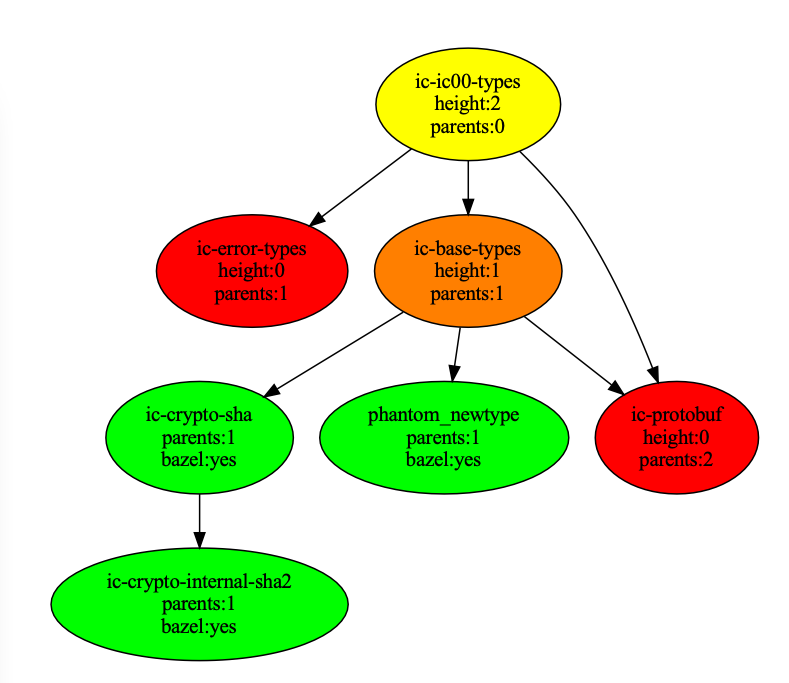
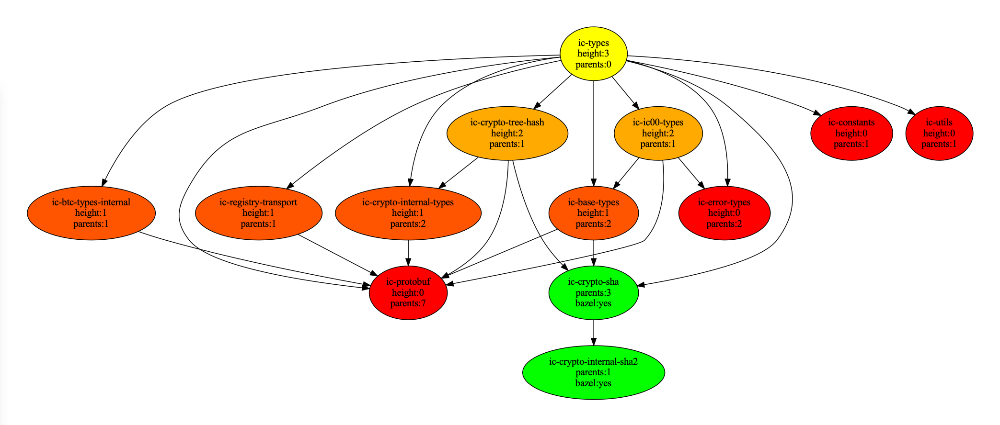
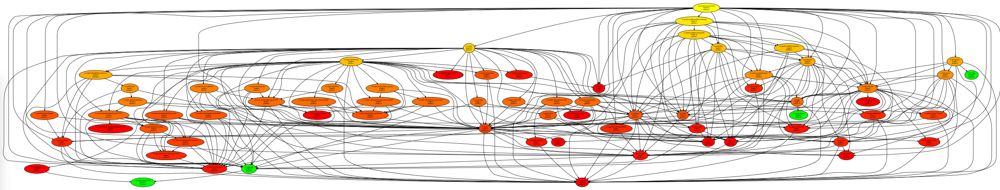

# ic-cargo-to-bazel-utils

## Goal

Help with `Cargo`-to-`Bazel` migration for the [Internet Computer](https://github.com/dfinity/ic) repository, namely with:

- understanding the progress
- optimizing the migration, by pointing to the next package for conversion
  - graph visualization
  - node height colors
    - `green` converted to Bazel
    - from `red` (leafs) to `yellow` (dependants) to be converted
  - parent count
  - CSV table with node height & parent count

## Examples

### ic-ic00-types

### ic-types

### ic-execution-environment

