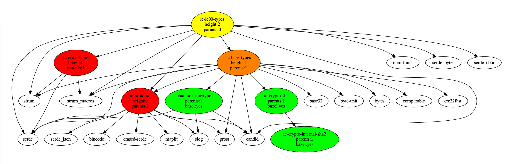
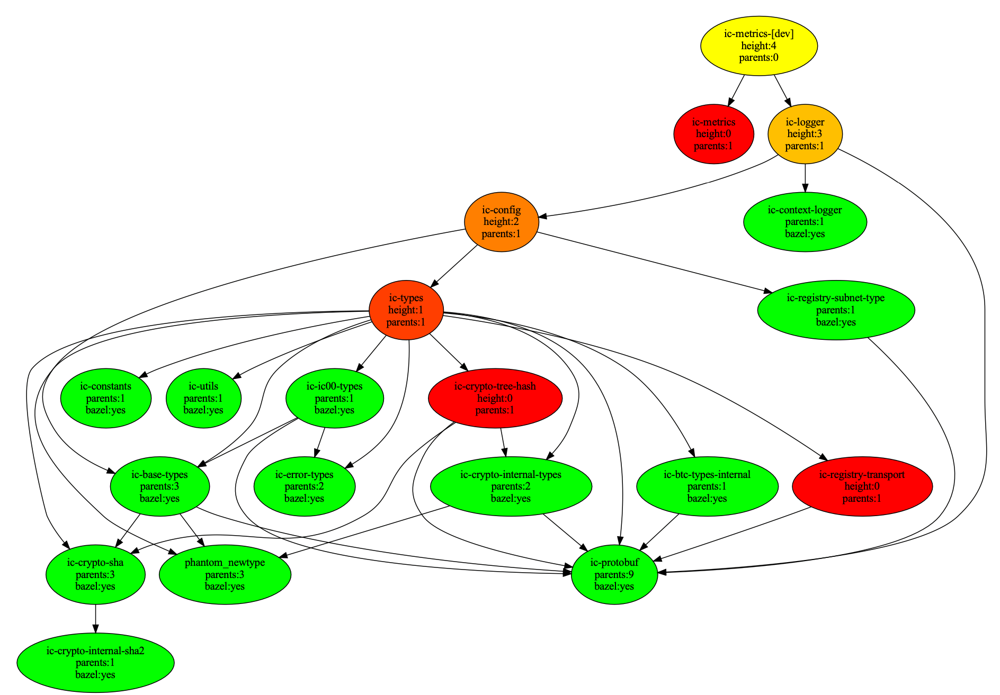

# ic-cargo-to-bazel-utils

## Goal

Help with Cargo-to-Bazel migration for the [Internet Computer](https://github.com/dfinity/ic) repository

## How?

- `main.py` script calculates for a specified root package
  - migration progress in output
  - dependent packages migration order in CSV report
  - dependent packages colored dependency graph in PDF chart
- `run_all.sh` has a predifined set of packages as example (feel free to modify for your needs)

## Notes

- provide `-dev` flag for `main.py` to include dev-dependency processing
- in CSV report 
  - packages are sorted by the height and the number of blocking parents (the most urgent are on top)
- in PDF colored dependency graph
  - `green` -- package is migrated
  - gradient from `red` to `yellow` -- not yet migrated package, color gradient is tree height (leaf is `red`)

## Usage

```bash
# Create folder for experiments
$ mkdir bazel-migration-order
$ cd bazel-migration-order

# Clone repositories
$ git clone git@github.com:dfinity/ic.git
$ git clone git@github.com:maksymar/ic-cargo-to-bazel-utils.git

# Run analysis
$ cd ic-cargo-to-bazel-utils
$ ./run_all.sh

# Inspect output
# Note: pay attention to the presence of `dev` option, eg. `all` and `all-dev`
Root package: all
Packages with bazel / no bazel / total / progress: 141 / 100 / 241 /  58.5%
Plotting 241 nodes with 1681 edges...

Root package: all-dev
Packages with bazel / no bazel / total / progress: 169 / 185 / 354 /  47.7%
Plotting 354 nodes with 2139 edges...

Root package: ic-execution-environment
Packages with bazel / no bazel / total / progress: 69 / 7 / 76 /  90.8%
Plotting 76 nodes with 354 edges...

Root package: ic-execution-environment-dev
Packages with bazel / no bazel / total / progress: 87 / 17 / 104 /  83.7%
Plotting 104 nodes with 597 edges...

# Inspect CSV reports:
# ./output/all.csv
# ./output/all-dev.csv

# Inspect PDF charts:
# ./output/ic-execution-enviroment.gv.pdf
```

## Examples

### ic-ic00-types (no 3rd party dependencies)


### ic-ic00-types (with 3rd party dependencies)


### ic-types


### ic-metrics-[dev]


### ic-execution-environment

