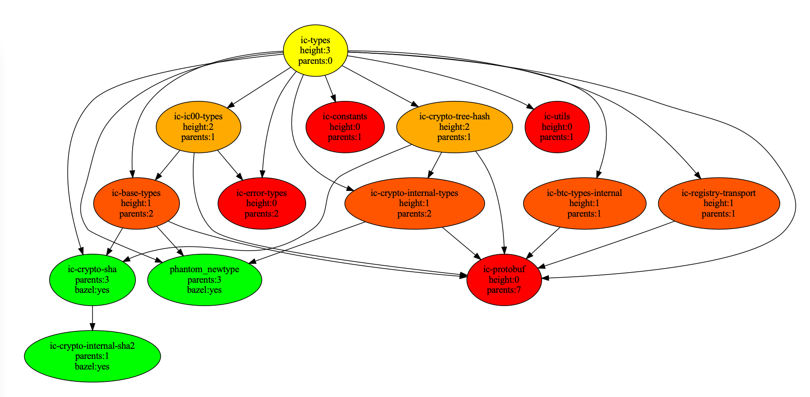

# ic-cargo-to-bazel-utils

## Goal

Help with Cargo-to-Bazel migration for the [Internet Computer](https://github.com/dfinity/ic) repository, namely with:

- understanding the progress
- optimizing the migration, by pointing to the next package for conversion
  - graph visualization
  - node height colors
    - `green` converted to Bazel
    - from `red` (leafs) to `yellow` (dependants) to be converted
  - parent count
  - CSV table with node height & parent count

## How To

```bash
$ mkdir bazel-migration-order
$ cd bazel-migration-order

$ git clone git@github.com:dfinity/ic.git
$ git clone git@github.com:maksymar/ic-cargo-to-bazel-utils.git

$ cd ic-cargo-to-bazel-utils
$ ./run_all.sh

Root package: all-dev
Root nodes linked to "fake-root": 143
Packages with bazel / no bazel / total / progress: 169 / 185 / 354 /  47.7%

Root package: ic-execution-environment-dev
Root nodes linked to "fake-root": 143
Packages with bazel / no bazel / total / progress: 87 / 17 / 104 /  83.7%

# Inspect CSV reports:
# ./output/all.csv
# ./output/all-dev.csv

# Inspect PDF charts:
# ./output/ic-execution-enviroment.gv.pdf
```

## Examples

### ic-ic00-types (no 3rd party dependencies)


### ic-ic00-types (with 3rd party dependencies)


### ic-types


### ic-metrics-[dev]


### ic-execution-environment

